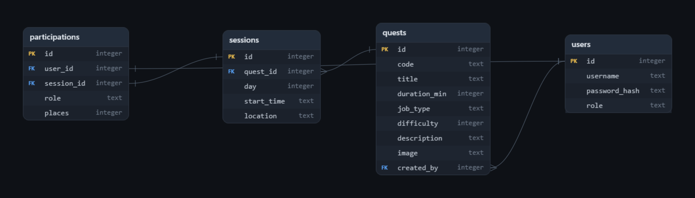

# FIBooking — Guild Management Web App
The 7/14/2026 exam project of the Introduction to Web Applications course
The project is designed as a GTA themed Guild Master application that users can book session of quests but with requirements.
The guild master runs the quests and sessions, they cannot join them.

## Spesifics for the web appplication

**Target device: desktop** (the layout also adapts to smaller screens through the Bootstrap grid).

**Simulated "now" time : Wednesday, 20:00 (config.py -> SIMULATED_NOW_DAY = 2, SIMULATED_NOW_TIME = "20:00")**
Booking freezes 8 hours before the run so every session starting before  **Thursday 4:00** is locked.

## Deployed application

The web application is deployed on PythonAnywhere at: **https://emreunlu.pythonanywhere.com**

## Running it locally

```
pip install -r requirements.txt
python app.py          # starts on http://localhost:5000
```

The SQLite database `db/guild.db` is included with the sample data already
loaded. To reset it to the exact sample data at any time run `python seed.py`.


### Sample accounts

| Username | Password | Role |
|----------|----------|------|
| lester   | lester123   | Guild Master |
| franklin | franklin123 | Adventurer |
| michael  | michael123  | Adventurer |
| trevor   | trevor123   | Adventurer |
| lamar    | lamar123    | Adventurer |

### Sample quests

| Code | Title | Type | Wanted | Duration | Venue |
|------|-------|------|--------|----------|-------|
| NS-0031 | Wire Transfer | Stealth | 2 | 60 min | Pacific Standard Bank |
| NS-0666 | The Pacific Standard Job | Big Score | 5 | 120 min | Pacific Standard Bank |
| NS-0172 | Loose Diamonds | Smash & Grab | 3 | 60 min | Diamond Casino |
| NS-0308 | Silent & Sneaky | Stealth | 4 | 90 min | Diamond Casino |
| NS-0450 | Gold Convoy | Transport | 3 | 75 min | Union Depository |
| NS-0245 | The Union Depository Contract | Loud | 4 | 120 min | Union Depository |


### The runs can be tested spesific to the exam requirements
Role categories in this app are the GTA equivalents of the exam's roles,
matched by capacity: **Gunman = Warrior (4 places)**, **Driver = Mage (3 places)**,
**Hacker = Healer (2 places)**.

| Requirement | Where to see it |
|---|---|
| 5 registered users (1 Guild Master + 4 adventurers) | Accounts table above -> log in with any of them to test |
| 6 quests | Job board shows all six |
| At least 2 quest sessions per day | Job board: filter by each day, every day has exactly 2 runs |
| A session that is still modifiable (no participants) | **The Pacific Standard Job — Thu 10:00, Pacific Standard Bank**: log in as `lester`, open the planner, this run has "no bookings yet" and shows the Edit/Cancel buttons |
| Participations for all three role categories | Gunman: `michael`, `franklin`, `lamar` — Driver: `trevor` — Hacker: `franklin`, `lamar` |
| One role category fully booked | **The Union Depository Contract — Thu 20:00, Union Depository**: Hacker shows **FULL (2/2)**; the Hacker radio button is disabled in the join form |
| A non-modifiable participation (8-hour rule) | Log in as `franklin` → My Jobs: **Gold Convoy — Wed 23:00** is marked *Locked* (starts in 3 h, inside the 8-hour window), no Change/Cancel buttons |
| A modifiable participation | Same page: `franklin`'s booking on **The Union Depository Contract — Thu 20:00** is *Open*, it can be changed or cancelled |


Extra tests to try:

1. Register a brand new adventurer and join an open run with 2 places.
2. As `lester`, create a new quest with several runs — scheduling two runs at
   the same location and overlapping time is rejected.
3. As any adventurer, try joining a 4th run or two overlapping runs, both are
   refused with an error message.


## The Database Structure
The diagram for the applications database is below (done with reverse engineering)


